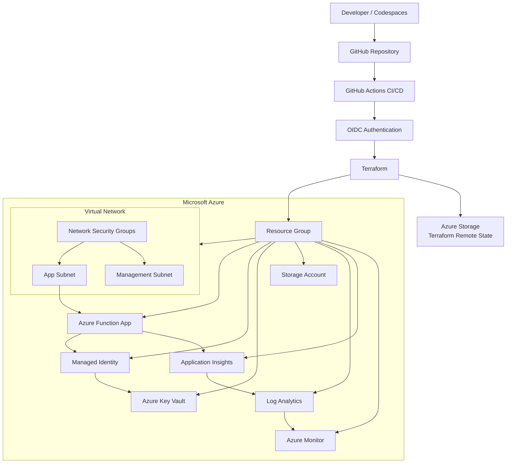

# Azure Production Platform

## Overview

This project is a production-style Azure cloud environment built with Terraform.

It demonstrates how to provision, secure, monitor, and automate Azure infrastructure using Infrastructure as Code and CI/CD.

The environment includes networking, identity, security controls, a serverless Python workload, monitoring, alerting, and automated deployment through GitHub Actions.

---

## Architecture



A more detailed architecture breakdown is available in [`architecture/architecture.md`](architecture/architecture.md).

---

## Technologies Used

- Microsoft Azure
- Terraform
- GitHub Actions
- GitHub Codespaces
- Azure CLI
- Microsoft Entra ID
- Azure RBAC
- Azure Key Vault
- Azure Functions
- Python
- Azure Monitor
- Application Insights
- Log Analytics

---

## Networking

The environment uses a dedicated Azure Virtual Network with separate subnets for application and management resources.

Network Security Groups are attached to the subnets to provide network-level access controls.

The application subnet is delegated to Azure Functions Flex Consumption for virtual network integration.

---

## Identity and Security

The environment uses a user-assigned managed identity for the application workload.

The Function App can access Azure Key Vault using Azure RBAC without storing application credentials in source code.

Security controls include:

- Managed Identity
- Azure RBAC
- Key Vault
- Network Security Groups
- TLS 1.2 minimum for storage
- Private Terraform state storage
- GitHub OIDC authentication
- No Azure client secret stored in GitHub

---

## Workload

The workload is a Python Azure Function running on the Azure Functions Flex Consumption plan.

The application includes a health endpoint:

```text
/api/health