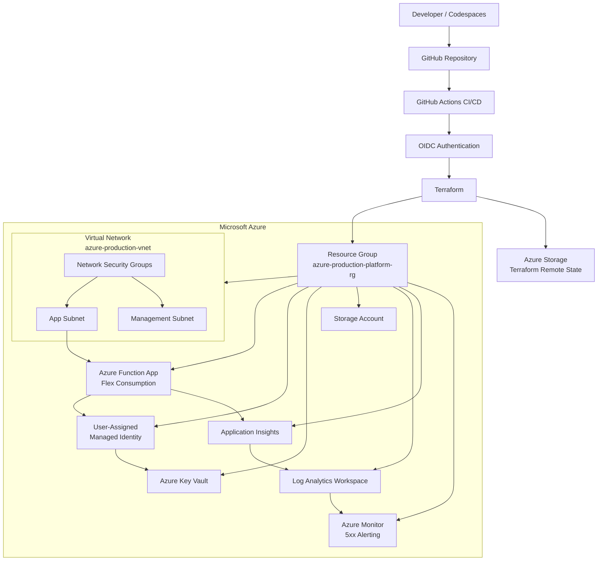

# Azure Production Platform Architecture

```mermaid
flowchart TD

    DEV["Developer / Codespaces"]
    GH["GitHub Repository"]
    GHA["GitHub Actions CI/CD"]
    OIDC["OIDC Authentication"]
    TF["Terraform"]

    subgraph AZURE["Microsoft Azure"]

        RG["Resource Group<br/>azure-production-platform-rg"]

        subgraph NETWORK["Virtual Network<br/>azure-production-vnet"]
            APPNET["App Subnet"]
            MGMTNET["Management Subnet"]
            NSG["Network Security Groups"]
        end

        FUNC["Azure Function App<br/>Flex Consumption"]
        ID["User-Assigned<br/>Managed Identity"]
        KV["Azure Key Vault"]
        STORAGE["Storage Account"]
        LAW["Log Analytics Workspace"]
        AI["Application Insights"]
        MON["Azure Monitor<br/>5xx Alerting"]

    end

    STATE["Azure Storage<br/>Terraform Remote State"]

    DEV --> GH
    GH --> GHA
    GHA --> OIDC
    OIDC --> TF
    TF --> RG

    RG --> NETWORK
    RG --> FUNC
    RG --> ID
    RG --> KV
    RG --> STORAGE
    RG --> LAW
    RG --> AI
    RG --> MON

    APPNET --> FUNC
    NSG --> APPNET
    NSG --> MGMTNET

    FUNC --> ID
    ID --> KV

    FUNC --> AI
    AI --> LAW
    LAW --> MON

    TF --> STATE
```